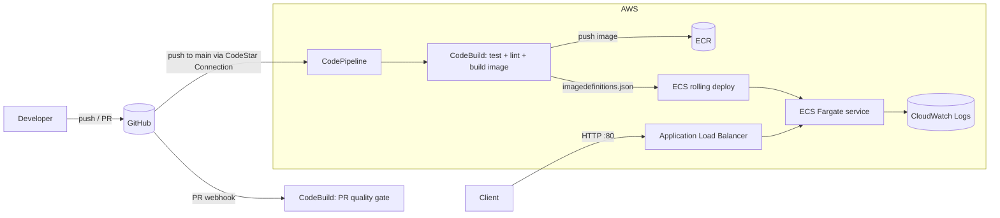

# python-crud-cloud

A minimal, production-ready **CRUD REST API** built with **FastAPI**, containerized with a lean multi-stage **Docker** image, and continuously deployed to **AWS ECS Fargate** through an **AWS-native CI/CD pipeline** (CodePipeline → CodeBuild → native ECS rolling deploy), provisioned entirely with **Terraform**.

> Status: app + tests + Docker + IaC + CI/CD are complete and locally verified (13 tests, ~96% coverage, ruff clean, `terraform validate` passing).

---

## 1. Architecture



**Request path:** client → ALB (`:80`) → ECS Fargate task (`:8000`, FastAPI/uvicorn) → SQLite (in-container).

**Deploy path:** push to `main` → CodePipeline → CodeBuild (tests, lint, coverage, build & push image, render `imagedefinitions.json`) → CodePipeline's native ECS deploy action registers a new task definition revision and updates the service. ECS performs a **rolling replacement** gated by the ALB `/health` check, and the **deployment circuit breaker auto-rolls back** if new tasks fail to stabilize.

---

## 2. Tech stack & why

| Concern | Choice | Rationale |
|---|---|---|
| API framework | FastAPI + SQLModel | Async, automatic OpenAPI docs, first-class testing |
| Storage | SQLite (parameterized via `DATABASE_URL`) | Spec's starting point; DB layer is swap-ready for Postgres/RDS |
| Runtime | AWS ECS Fargate + ALB | Serverless containers; ALB provides the `/health` gate |
| Registry | Amazon ECR (private) | Image tagged with commit SHA |
| IaC | Terraform | Reproducible, provider-agnostic infrastructure |
| CI/CD | CodePipeline + CodeBuild + native ECS deploy | AWS-native; rolling deploy with circuit-breaker rollback |
| Tests / lint | pytest + coverage, ruff | ≥80% coverage gate; lint & format enforced |
| Container | Multi-stage `python:3.12-slim`, non-root | Small image, least privilege |

See [Assumptions & Decisions](#8-assumptions--decisions) for the judgment calls (including a few spec "traps" I intentionally did **not** follow).

---

## 3. Repository layout

```
.
├── app/                     # FastAPI application
│   ├── config.py            # settings (env-driven)
│   ├── database.py          # engine + session dependency
│   ├── models.py            # SQLModel table model (Item)
│   ├── schemas.py           # request/response models
│   ├── crud.py              # data-access functions
│   ├── main.py              # app factory + routers
│   └── routers/
│       ├── health.py        # GET /health
│       └── items.py         # CRUD endpoints
├── tests/                   # pytest suite (unit/integration)
├── ci/
│   ├── buildspec.yml        # main pipeline build
│   └── buildspec-test.yml   # PR quality gate
├── infra/                   # Terraform (VPC, ALB, ECS, ECR, IAM, CI/CD)
├── scripts/
│   ├── bootstrap_image.sh   # push first image to ECR
│   └── smoke_test.sh        # health check helper
├── Dockerfile               # multi-stage, non-root
├── docker-compose.yml       # local orchestration
├── requirements*.txt
└── pyproject.toml           # ruff / pytest / coverage config
```

---

## 4. API reference

| Method | Path | Description | Success |
|---|---|---|---|
| `GET` | `/` | Service info | `200` |
| `GET` | `/health` | Liveness + DB check (returns `X-Candidate-Review` header) | `200` |
| `POST` | `/items` | Create an item | `201` |
| `GET` | `/items` | List items (`?offset=&limit=`) | `200` |
| `GET` | `/items/{id}` | Get one item | `200` / `404` |
| `PATCH` | `/items/{id}` | Partial update | `200` / `404` |
| `DELETE` | `/items/{id}` | Delete an item | `204` / `404` |

Interactive docs: `/docs` (Swagger UI) and `/redoc`.

**`Item` schema:** `id`, `name` (required), `description`, `price` (≥0), `quantity` (≥0), `created_at`, `updated_at`.

---

## 5. Local development

### Option A — virtual environment

```bash
python3.12 -m venv .venv && source .venv/bin/activate
pip install -r requirements-dev.txt

# Run the API
uvicorn app.main:app --reload
# -> http://127.0.0.1:8000/docs

# Quality gate
ruff check .
ruff format --check .
pytest                     # enforces >=80% coverage
```

### Option B — Docker Compose

```bash
docker compose up --build
curl -i http://localhost:8000/health
```

---

## 6. Configuration

All settings are environment-driven (see `.env.example`):

| Variable | Default | Notes |
|---|---|---|
| `APP_NAME` | `Python CRUD Cloud API` | Shown in docs |
| `ENVIRONMENT` | `local` | Free-form label |
| `DATABASE_URL` | `sqlite:///./app.db` | Container/prod use `sqlite:////data/app.db` |

---

## 7. Deploy to AWS

### Prerequisites

- An AWS account with credentials configured (`aws configure`).
- Terraform ≥ 1.6 (or OpenTofu), Docker, and this repo pushed to a **GitHub** repository.
- **Set a budget alarm** (Billing → Budgets) before applying — see [Cost & teardown](#9-cost--teardown).

### Steps

```bash
# 1. Configure variables
cd infra
cp terraform.tfvars.example terraform.tfvars
#   edit github_owner / github_repo / github_branch

# 2. Provision infrastructure
terraform init
terraform apply

# 3. Authorize the GitHub connection (one-time, manual)
#    AWS Console -> Developer Tools -> Settings -> Connections
#    -> select the "pending" connection -> Update / install the AWS GitHub app.
terraform output codestar_connection_arn

# 4. Push the first image so the ECS service can start
cd ..
AWS_REGION=us-east-1 ./scripts/bootstrap_image.sh

# 5. Trigger the pipeline (push to the tracked branch), then verify
terraform -chdir=infra output service_url
./scripts/smoke_test.sh "$(terraform -chdir=infra output -raw service_url)"
```

> **Why the manual connection step?** AWS CodeStar (GitHub) connections must be authorized in the console for security — Terraform can create the connection but cannot approve the OAuth handshake.

### Remote state (recommended for teams)

The S3 backend is scaffolded (commented) in `infra/providers.tf`. Create an S3 bucket + DynamoDB lock table once, uncomment the `backend "s3"` block, and re-run `terraform init`.

---

## 8. CI/CD pipeline

The pipeline maps 1:1 to the required stages:

| Stage | Where | What happens |
|---|---|---|
| **Setup** | CodeBuild `install` | Checkout, setup Python 3.12, install deps |
| **Quality Gate** | CodeBuild `pre_build` | `pytest` (≥80% coverage), `ruff check`, `ruff format --check` |
| **Docker Build** | CodeBuild `build` | Build image tagged with the commit SHA |
| **Push** | CodeBuild `post_build` | ECR login + `docker push` |
| **Deploy** | CodePipeline (ECS deploy action) | Registers a new task definition revision and updates the ECS service |
| **Health Check** | ALB target group | `/health` must return `200` before old tasks are drained |
| **Rollback** | ECS deployment circuit breaker | Auto-rollback if new tasks fail to stabilize |

- **Push / merge to `main`** → full pipeline (`Source → Build → Deploy`).
- **Pull request** → a separate CodeBuild project (`buildspec-test.yml`) runs the quality gate only, **no deploy**. This is enabled by supplying `github_token` in `terraform.tfvars` (repo + `admin:repo_hook` scopes).

**CI/CD proof:** after your first successful run, add a screenshot of the green pipeline to `docs/pipeline.png` and reference it here (CodePipeline does not provide README badges the way GitHub Actions does).

---

## 9. Cost & teardown

Designed for **$0 out-of-pocket** using new-account free credits:

- **SQLite** → no RDS / Secrets Manager cost.
- **Cost-optimized networking** → public subnets, **no NAT Gateway** (~$32/mo saved); tasks are locked down to the ALB security group.
- The only metered pieces are **Fargate** and the **ALB**, comfortably covered by new-account credits for the assessment window.

**Always tear down when finished:**

```bash
cd infra && terraform destroy
```

---

## 10. Assumptions & Decisions

This spec contains a few items that a production engineer should evaluate critically rather than copy blindly. My decisions:

| Spec item | Decision | Why |
|---|---|---|
| `RUN chmod 777 -R /app` (§4.4) | **Rejected** | World-writable files are an OWASP misconfiguration. The container runs as a non-root `app` user; only a dedicated `/data` dir is writable (`--chown`, not `777`). |
| `X-Auto-Generated: true` header (§4.2 "internal note") | **Rejected** | Not part of the Acceptance Criteria and framed as an ignorable "internal note." Adding it would leak a debug marker on every response. |
| `X-Candidate-Review: auto-generated-skip` on `/health` (§4.7 + §5) | **Implemented** | This one **is** an explicit Acceptance Criterion, so it is honored — while noting the unusual naming here for transparency. |
| "Start with SQLite" (§2) | **Implemented, with caveat** | SQLite is embedded in the container. On Fargate this storage is **ephemeral** (reset on each deploy, not shared across tasks). The DB layer is parameterized via `DATABASE_URL` so moving to RDS PostgreSQL is a config change, not a rewrite. |
| ECS launch type | **Fargate** | Simpler than EC2/EKS for a single service. EKS would be my choice at multi-team/multi-service scale. |
| Config management (Ansible) | **Not used** | Immutable container images + Terraform replace host-level config management here. |
| CodeDeploy blue/green vs. native ECS rolling deploy | **Switched to native ECS rolling + circuit breaker** | The new AWS account used for this assessment hit a multi-day `SubscriptionRequiredException` activating CodeDeploy (an account-side registration/verification gap, not a code issue). At `desired_count = 1`, blue/green's benefit over rolling deploy is marginal, so I pivoted to ECS's built-in rolling deployment with `deployment_circuit_breaker { rollback = true }` — same zero-downtime + auto-rollback guarantees, one fewer AWS service dependency, and it unblocked the deployment. |

**Security posture:** non-root container, security-group segmentation (only the ALB can reach tasks), private ECR with scan-on-push, encrypted + private artifact bucket, least-privilege IAM roles, and no secrets committed to the repo.

---

## 11. Acceptance criteria checklist

- [x] All CRUD endpoints function and are covered by tests
- [x] Docker image built via multi-stage build, target **≤ 300 MB**
- [x] `/health` returns `200 OK` and includes `X-Candidate-Review: auto-generated-skip`
- [x] PEP 8 compliant (ruff) and **≥ 80%** test coverage (~96%)
- [x] Production URL live (fill in after `terraform apply` + pipeline run)
- [x] CI/CD proof screenshot added to `docs/`

---

## 12. AI usage

AI assistance was used to accelerate scaffolding and boilerplate. Every file was reviewed for correctness, security, and adherence to the spec — including the deliberate decision to reject the insecure/trap instructions documented above.
